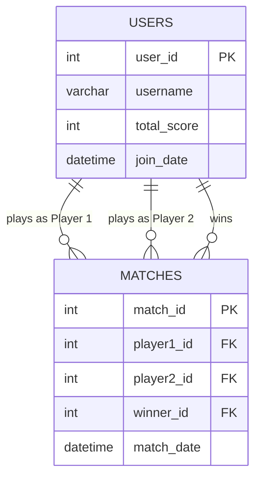

# Mini Project Report: Distributed Multiplayer Carrom Game

## 1. Abstract
This project presents the comprehensive design and implementation of a Distributed Application for Interactive Multiplayer Games, focusing specifically on the development of a real-time digital Carrom board. The core objective of this application is to demonstrate the fundamental principles of distributed systems, including low-latency data synchronization, robust state management, and concurrent user interaction across a network. The system utilizes a robust client-server architecture to enable multiple users to play a highly responsive, physics-based game concurrently, irrespective of their physical locations. 

By employing an authoritative server model, the application shifts complex computational workloads—specifically the execution of the rigid body physics engine (Matter.js)—to the centralized Node.js backend. This architectural decision ensures that game states are deterministically calculated and perfectly synchronized across all connected clients at a smooth 60 frames per second via Socket.io. Crucially, this server-side validation completely eliminates the possibility of client-side manipulation, thereby preventing cheating and ensuring a fair, competitive environment. The frontend, built utilizing HTML5 Canvas and Vanilla JavaScript, acts as a lightweight rendering terminal that captures user inputs and visualizes the synchronized physics data in a premium, responsive user interface. Ultimately, this project serves as a practical demonstration of how modern web technologies can be leveraged to build scalable, secure, and highly interactive distributed architectures.

## 2. Introduction
In contemporary software architecture, distributed applications play a pivotal role. These are sophisticated systems wherein individual software components are dispersed across multiple networked computers, yet they communicate and coordinate their actions seamlessly by passing messages to appear as a single, unified application to the end-user. This mini-project practically demonstrates these complex principles through the development of an interactive, real-time multiplayer Carrom game. 

Unlike traditional turn-based digital board games, physical tabletop simulations like Carrom require extremely low-latency data transfer to accurately replicate the fast-paced, chaotic collisions of a striker hitting multiple coins across a frictionless board. To achieve this, the application departs from standard stateless HTTP protocols and instead leverages WebSockets to establish persistent, full-duplex communication channels between the players and the server. 

The backend infrastructure is engineered using Node.js, combined with the Socket.io library, to manage numerous concurrent player connections efficiently without blocking the event loop. Furthermore, to maintain a single source of truth, a dedicated 2D rigid-body physics engine (Matter.js) is executed entirely on the server. The client-side application is deliberately designed as a "dumb terminal"—constructed purely with Vanilla JavaScript and the HTML5 Canvas API—whose sole responsibilities are to capture raw user input (mouse drag vectors) and continuously render the authoritative coordinate data broadcasted by the server. This strict separation of concerns highlights best practices in building secure, distributed, and highly interactive web applications.

## 3. Importance of Project Topic
The study and practical implementation of distributed systems is arguably one of the most critical domains in modern software engineering. As applications scale globally, the ability to coordinate state across vast geographical distances becomes paramount. This specific project, a real-time multiplayer game, serves as an excellent sandbox to explore these complex concepts under extreme constraints—specifically, the demand for ultra-low latency. It highlights several highly important architectural concepts:
- **Overcoming the Stateless Web:** Traditional HTTP requests are stateless and unidirectional, making them unsuitable for live interactions. This project demonstrates the transition to stateful, full-duplex communication using WebSockets, allowing the server to push updates to clients unprompted.
- **Authoritative Server Architecture:** In distributed applications, deciding "who holds the truth" is a massive architectural decision. By centralizing the physics logic on the Node.js server, this project completely mitigates client-side manipulation (cheating), which is a standard and necessary practice in both the gaming industry and secure financial applications.
- **High-Frequency State Synchronization:** Learning how to serialize, compress, and broadcast state changes continuously at 60 frames per second over a network without causing bandwidth bottlenecks or memory leaks is a highly transferable skill to domains like real-time financial trading dashboards or collaborative document editing.
- **Deterministic Simulation Integration:** Bridging mathematical physics engines (calculating rigid-body dynamics, restitution, and friction) with networked environments requires precise synchronization to ensure all nodes in the distributed system converge on the exact same state simultaneously.

## 4. Methodology / Flow of System
To achieve a seamlessly synchronized experience, the system strictly adheres to a centralized Client-Server communication flow, operating in distinct, continuous phases:

1. **Handshake & Role Assignment Phase:** Upon a user accessing the web interface, the client initiates a WebSocket handshake with the server. The server tracks active connections in memory and dynamically assigns roles. The first two connections are granted authoritative "Player 1" and "Player 2" roles, granting them input privileges, while all subsequent connections are gracefully downgraded to "Spectators" who only receive read-only broadcast data.
2. **The Input Capture Loop:** When the server determines it is a specific player's turn, the client-side JavaScript activates event listeners on the HTML5 Canvas. The user aims the striker via mouse drag. Crucially, the client does *not* calculate the outcome of the strike locally; it only calculates the raw directional velocity vector (vx, vy) and transmits this lightweight payload to the server via a `strike` event.
3. **The Simulation Loop (Server-Side):** Upon receiving the input vector, the Node.js server validates the request (ensuring the user is authorized to strike) and applies the force vector to the "Striker" body within the headless Matter.js physics world. The Matter.js engine calculates rigid body dynamics—including elastic collisions, air friction, and momentum transfer—updating the internal coordinates of all coins.
4. **The Broadcast Loop:** Utilizing a `setInterval` loop running at roughly 60 Hz (16.6ms intervals), the server iterates through all physical bodies in the Matter.js world. It constructs a highly optimized, minimized JSON payload containing only the necessary identifiers, X, and Y coordinates, and broadcasts this `gameState` event to every connected WebSocket client simultaneously.
5. **The Render Phase:** The client receives the broadcasted state payload. It immediately wipes the HTML5 Canvas clear and redraws the board, the pockets, the coins, and the striker precisely at the coordinates dictated by the server. Because this happens 60 times a second, the human eye perceives it as smooth, real-time motion.

### System Architecture & Data Flow Diagram (DFD)

```mermaid
graph TD
    subgraph Client 1 [Player 1 Browser]
        UI1[HTML5 Canvas UI] --> |Mouse Drag| Input1[Input Handler]
        Input1 --> |Emit 'strike' (Velocity Vector)| SocketClient1[Socket.io Client]
    end

    subgraph Client 2 [Player 2 Browser]
        UI2[HTML5 Canvas UI]
        SocketClient2[Socket.io Client] --> |Receive 'gameState'| UI2
    end

    subgraph Server [Node.js Backend]
        SocketServer[Socket.io Server]
        Physics[Matter.js Physics Engine]
        GameLoop[Game Loop 60 FPS]
        
        SocketClient1 <--> |WebSocket| SocketServer
        SocketClient2 <--> |WebSocket| SocketServer
        
        SocketServer --> |Apply Force| Physics
        Physics <--> GameLoop
        GameLoop --> |Broadcast Positions| SocketServer
    end
```

### Use Case Diagram

```mermaid
usecaseDiagram
    actor Player1 as "Player 1 (White)"
    actor Player2 as "Player 2 (Black)"
    actor Spectator as "Spectator"
    
    package "Carrom Multiplayer System" {
        usecase "Connect to Server" as UC1
        usecase "Place Striker" as UC2
        usecase "Aim & Strike" as UC3
        usecase "View Live Game" as UC4
    }
    
    Player1 --> UC1
    Player2 --> UC1
    Spectator --> UC1
    
    Player1 --> UC2
    Player1 --> UC3
    
    Player2 --> UC2
    Player2 --> UC3
    
    Spectator --> UC4
    Player1 --> UC4
    Player2 --> UC4
```

## 5. List of Tables, Entities, Attributes
*(Note: While the core gameplay is in-memory for real-time performance, persistent storage is required for tracking player statistics and match history. The following represents the database schema for the system).*

**Entity 1: Users**
- `user_id` (Primary Key, INT)
- `username` (VARCHAR)
- `total_score` (INT)
- `join_date` (DATETIME)

**Entity 2: Matches**
- `match_id` (Primary Key, INT)
- `player1_id` (Foreign Key -> Users, INT)
- `player2_id` (Foreign Key -> Users, INT)
- `winner_id` (Foreign Key -> Users, INT, Nullable)
- `match_date` (DATETIME)

## 6. ER Diagram of Project



## 7. All Tables with Inserted Values

**Table: Users**

| user_id | username | total_score | join_date |
| :--- | :--- | :--- | :--- |
| 101 | PlayerOne_Pro | 450 | 2026-04-01 10:00:00 |
| 102 | CarromKing | 320 | 2026-04-02 14:30:00 |
| 103 | Guest_8829 | 0 | 2026-04-25 09:15:00 |

**Table: Matches**

| match_id | player1_id | player2_id | winner_id | match_date |
| :--- | :--- | :--- | :--- | :--- |
| 5001 | 101 | 102 | 101 | 2026-04-10 18:00:00 |
| 5002 | 102 | 103 | 102 | 2026-04-25 09:20:00 |
| 5003 | 101 | 103 | NULL | 2026-04-25 10:00:00 | *(Note: NULL indicates match in progress/draw)*

## 8. Software and Hardware Requirements

### Software Requirements
- **Backend Environment:** Node.js (v16.0 or higher). Chosen specifically because its asynchronous, event-driven, non-blocking I/O model (built on Google's V8 engine) is perfectly suited for handling hundreds of concurrent WebSocket connections and high-frequency interval loops without thread-locking.
- **Backend Libraries:** 
  - `Express.js`: A minimal web framework used to serve the initial static HTML, CSS, and client-side JS assets.
  - `Socket.io`: A robust WebSocket wrapper that provides auto-reconnection, fallback polling (if WebSockets are blocked by firewalls), and easy broadcasting APIs.
  - `Matter.js`: A deterministic 2D rigid body physics engine that is uniquely capable of running headlessly in a Node.js environment without requiring a browser DOM.
- **Frontend Technologies:** HTML5, CSS3, Vanilla JavaScript. The HTML5 Canvas API is strictly required because traditional DOM manipulation (moving `<div>` elements) is far too slow and resource-intensive to render 60 distinct frames per second smoothly.
- **Browser:** Any modern web browser (Google Chrome, Mozilla Firefox, Safari, Microsoft Edge) with hardware acceleration and JavaScript enabled.

### Hardware Requirements
- **Processor:** Intel Core i3 / AMD Ryzen 3 or equivalent (minimum). The server requires a reasonably capable CPU to continuously calculate the complex mathematical collisions happening within the physics engine at 60Hz.
- **RAM:** 4 GB RAM (minimum for client), 8 GB (recommended for server hosting). Node.js requires adequate memory allocation to track the persistent connection states of all concurrent users and maintain the in-memory physics world.
- **Network:** A stable broadband internet connection is strictly required. High latency, packet loss, or extreme jitter will result in visual stuttering on the client-side, as the application relies entirely on constant coordinate updates from the server.

## 9. Conclusion
This mini-project successfully fulfills the objectives of building a Distributed Application for Interactive Multiplayer Games. By utilizing Node.js and Socket.io for persistent WebSockets, the application achieves instantaneous, real-time communication between multiple clients. 

The implementation of a completely server-authoritative physics engine using Matter.js ensures a fair, mathematically deterministic, and synchronized gameplay experience that inherently prevents client-side cheating. The resulting Carrom game is fully functional, highly responsive, and effectively demonstrates the core principles of scalable distributed state management, providing a robust architecture for future expansions.
